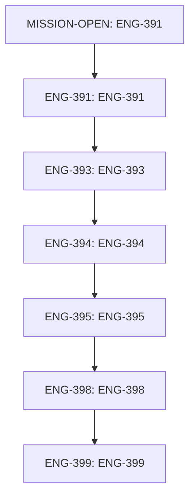

# Plan Checklist — dev-lead-sources-explorer-v1

Generated: 2026-06-11T04:30:17Z
Mission: `dev-lead-sources-explorer-v1`
Status: completed
Primary source: `.agents/orchestration/dev-lead-sources-explorer-v1`

## Business Goal

Give the clinic owner marketing-first visibility into the lead → consult →
chair pipeline per acquisition resource.

One new DEV-tools tab (`/dev/lead-sources`) shows every lead source/resource
in hierarchical order (effective source → utm_medium → utm_campaign) with
live funnel counts per node:

- leads attached to the node;
- consultations scheduled for the persons of those leads;
- consultations attended (completed) for the persons of those leads.

Filters: period over lead creation time, text search over node labels.
Clicking a node drills down into the underlying lead list with full lead
data and creation timestamps.

Linear: ENG-391
https://linear.app/fusion-dental-implants/issue/ENG-391/dev-lead-sources-explorer-hierarchical-source-tree-with-funnel-counts

## Source Of Truth

- `.agents/orchestration/dev-lead-sources-explorer-v1/goal.md`
- `.agents/orchestration/dev-lead-sources-explorer-v1/acceptance.md`
- `.agents/orchestration/dev-lead-sources-explorer-v1/contract.md`
- `.agents/orchestration/dev-lead-sources-explorer-v1/verification.md`
- `.agents/orchestration/dev-lead-sources-explorer-v1/ownership.yaml`
- `/Users/eduardkarionov/.fusion-agent-orchestrator/c2db50910d08/dev-lead-sources-explorer-v1/board.md`
- `/Users/eduardkarionov/.fusion-agent-orchestrator/c2db50910d08/dev-lead-sources-explorer-v1/linear-sync.md`
- `/Users/eduardkarionov/.fusion-agent-orchestrator/c2db50910d08/dev-lead-sources-explorer-v1/runtime.json`

## Strategic Lineage

- Strategy Agent candidate source: `.agents/strategy/CANDIDATE_MISSIONS.md` — not matched
- Strategy Agent handoff source: `.agents/strategy/HANDOFF_TO_ORCHESTRATOR.md` — not matched
- Orchestrator execution mission: `dev-lead-sources-explorer-v1`
- Linear parent / first task: `MISSION-OPEN`
- Rule: Strategy proposes, Orchestrator disposes. This checklist is execution control, not a replacement for strategy artifacts.

## Strategy Context

_No matching strategy handoff section found._

## Implementation Plan

- [x] MISSION-OPEN — ENG-391
- [x] ENG-391 — ENG-391
- [x] ENG-393 — ENG-393
- [x] ENG-394 — ENG-394
- [x] ENG-395 — ENG-395
- [x] ENG-398 — ENG-398
- [x] ENG-399 — ENG-399
- [x] Keep `runtime.json`, `board.md`, `linear-sync.md`, `runlog.md`, and worker reports synchronized with actual progress.
- [x] Update this `PLAN_CHECKLIST.md` after each worker wave, verification pass, or scope change.

## Acceptance Checklist

- [x] New "Lead sources" tab appears in the DEV menu (`AppShell.tsx` devToolItems) and renders real data from FastAPI.
- [x] Tree groups leads by effective source (coalesce `Lead.source` → `extra.lead_source` → `extra.hubspot_lead_source` → `extra.utm_source`, fallback "unknown"), expandable into `utm_medium` → `utm_campaign`.
- [x] Every node shows three counts: leads, consults_scheduled (status SCHEDULED), consults_attended (status COMPLETED), joined via `person_uid`.
- [x] Period filter (lead `created_at` from/to) and node-label search are applied server-side and change the counts.
- [x] Clicking a node opens the lead list for that node: status, source and attribution fields, person_uid, created_at; sorted by created_at desc; paginated.
- [x] Endpoints live in `apps/api/routers/` (prod routing split). No Next.js route handlers, no MSW fallback left behind.
- [x] Route → service → repository layering respected; queries tenant-scoped.
- [x] `make lint`, `mypy .`, `make test` green; `alembic check` clean (no new migration expected — read-only aggregation).
- [x] Frontend `tsc --noEmit`, lint, and existing vitest suite green.

## Contract Checklist

- [x] Contract section present: Contract — ENG-391

## Implementation DAG / Waves

## Linear Map

| Task | Linear | Owner | Agent | Status | Worktree | Branch | Report | Needs human | Updated |
| --- | --- | --- | --- | --- | --- | --- | --- | --- | --- |
| MISSION-OPEN | ENG-391 | orchestrator | claude-code | completed | . | codex/eng-371-manager-answer-layer-v1 | no | no | 2026-06-11T01:18:00Z |
| ENG-391 | ENG-391 | worker | claude-code/self-execute | completed | . | codex/eng-371-manager-answer-layer-v1 | yes | no | 2026-06-11T02:45:00Z |
| ENG-393 | ENG-393 | worker | claude-code/self-execute | completed | . | codex/eng-371-manager-answer-layer-v1 | no | no | 2026-06-11T05:15:00Z |
| ENG-394 | ENG-394 | worker | claude-code/self-execute | completed | . | codex/eng-371-manager-answer-layer-v1 | no | no | 2026-06-11T05:15:00Z |
| ENG-395 | ENG-395 | worker | claude-code/self-execute | completed | . | codex/eng-371-manager-answer-layer-v1 | no | no | 2026-06-11T05:15:00Z |
| ENG-398 | ENG-398 | worker | claude-code/self-execute | completed | . | codex/eng-371-manager-answer-layer-v1 | no | no | 2026-06-11T07:05:00Z |
| ENG-399 | ENG-399 | worker | claude-code/self-execute | completed | . | codex/eng-371-manager-answer-layer-v1 | no | no | 2026-06-11T07:05:00Z |

## Ownership / Write Scopes

Review `.agents/orchestration/dev-lead-sources-explorer-v1/ownership.yaml` before launching or self-executing work.

- [x] Every active execution task has a Linear issue id and URL.
- [x] Every worker has an allowed write scope.
- [x] No worker edits `.env*`, shipped Alembic revisions, or out-of-scope files.
- [x] Concurrent work is isolated or explicitly recorded as self-execute scope.

## Verification Gate

- [x] `make lint`
- [x] `mypy .`
- [x] `make test` (full pytest; new tests for tree aggregation + drill-down
- [x] `cd packages/db && alembic check`
- [x] `npx tsc --noEmit`
- [x] `npm run lint`
- [x] `npx vitest run`
- [x] `GET /api/ops/analytics/lead-sources/tree` returns hierarchical buckets
- [x] `/dev/lead-sources` renders the tree, filters, search, and drill-down.

## Open Risks

- [ ] Confirm whether this mission needs a Strategy handoff entry or whether the mission spec is the accepted scope.
- [x] Confirm dashboard/runtime state points at this mission before launching workers.
- [x] Confirm no unrelated dirty files are mixed into the mission diff.
- [x] Record blockers with exact markers: `Blocked:`, `Needs decision:`, `Needs approval:`, `Verification failed:`.

## Resume Prompt

Use the Fusion CRM Orchestrator protocol. Read this `PLAN_CHECKLIST.md` first,
then inspect `goal.md`, `acceptance.md`, `contract.md`, `verification.md`,
`ownership.yaml`, runtime `board.md`, `linear-sync.md`, `runlog.md`,
`incidents.md`, `decision-log.md`, and worker reports. Update checklist boxes
only when evidence exists in mission files, runtime files, Linear, git, or
verification output. Do not infer progress from terminal-only claims.
