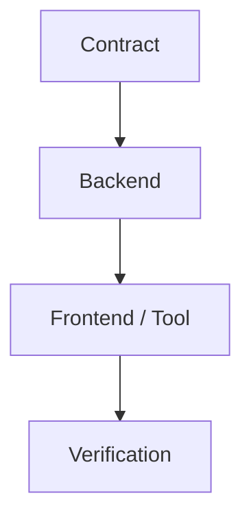

# Mission Plan Checklist

Mission:
Linear parent:
Generated from:
Status:

## Business Goal

State the user/business outcome in plain English.

## Source Of Truth

- Strategy agent candidate mission:
- Strategy agent handoff:
- Strategy handoff:
- Mission goal:
- Acceptance:
- Contract:
- Verification:
- Runtime board:
- Linear sync:

## Strategic Lineage

Use this section to connect execution work back to the Strategy Agent's
long-term plan, roadmap theme, candidate mission, and Orchestrator handoff.

- Strategic theme:
- Candidate mission:
- Handoff readiness:
- Orchestrator acceptance:
- Linear parent:
- Execution mission:

## Implementation Plan

- [ ] Define or confirm the contract.
- [ ] Implement backend/service behavior.
- [ ] Implement frontend or tool surface.
- [ ] Add focused tests.
- [ ] Run verification.
- [ ] Record closure evidence.

## Acceptance Checklist

- [ ] Acceptance item 1.
- [ ] Acceptance item 2.

## Implementation DAG / Waves

```text
Wave 1: contract and backend foundations
Wave 2: consumers and UI
Wave 3: verification, smoke, and closure
```



## Linear Map

| Task | Linear | Status | Owner | Notes |
| --- | --- | --- | --- | --- |
| TBD | TBD | Planned | TBD | TBD |

## Ownership / Write Scopes

Document allowed write paths, explicit no-touch paths, and concurrent work.

## Verification Gate

- [ ] `make lint`
- [ ] `mypy .`
- [ ] `make test`
- [ ] `cd packages/db && alembic check`
- [ ] Browser or local smoke where relevant.

## Open Risks

- [ ] Missing Linear or unclear ownership.
- [ ] Contract drift.
- [ ] Verification gaps.
- [ ] Dirty branch or unrelated diff.

## Resume Prompt

Use the Fusion CRM Orchestrator protocol. Read this `PLAN_CHECKLIST.md` first,
then inspect mission goal, acceptance, contract, verification, board, Linear
sync, runlog, incidents, decision log, and worker reports. Update this file as
work completes. Do not infer progress that is not visible in mission/runtime
files or git.
