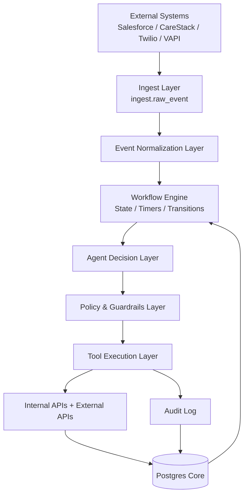

# Flexible Agent-Driven Workflow Layer
## Strategic White Paper Section for the Dental Operations Platform

**Version:** 0.1  
**Prepared:** May 2026  
**Document type:** Strategic architecture section  
**Scope:** Workflow orchestration, agent decision layer, role-based agent creation, governance, and tool-based execution.

---

## 1. Purpose

This document defines a strategic architecture for building a **flexible, event-driven workflow layer** enhanced by an **agent-based decision system**.

The purpose of this layer is to allow the platform to move beyond static CRM logic and become an adaptive operational system where:

- workflows are driven by real events;
- agents interpret context and recommend next actions;
- tools execute only approved actions;
- office staff can create role-specific agents without writing code;
- every decision and tool call is logged, auditable, and permission-controlled.

This architecture is designed for a dental operations platform that integrates data and workflows across:

- Salesforce;
- CareStack;
- Twilio / SMS / WhatsApp;
- VAPI / voice agents;
- internal Postgres database;
- internal coordinator and manager workspaces.

---

## 2. Strategic Thesis

The platform should not be built as another static CRM with hardcoded business logic.

Instead, it should become an **AI-driven operational layer** where the system combines:

```text
Data + Events + Tools + Policies + Agents
```

Each component has a clear responsibility:

| Component | Responsibility |
|---|---|
| Data | Stores the source of truth and historical context |
| Events | Represent everything that happens in the business |
| Tools | Execute controlled actions through APIs and services |
| Policies | Define permissions, safety boundaries, and compliance rules |
| Agents | Interpret context and decide what should happen next |

The result is a system where workflows can evolve quickly without rebuilding core application logic every time the business process changes.

---

## 3. What This Layer Replaces

This approach reduces the need for large amounts of rigid procedural logic such as:

```text
if lead_status == "new" and attempt_count < 3 and no_answer:
    create_followup_task()
else if appointment_status == "no_show":
    start_recovery_sequence()
else if sms_reply_contains_callback_intent:
    schedule_callback()
```

Instead, the workflow engine controls state, while agents make contextual decisions based on the latest data.

The system moves from:

```text
Hardcoded rules + manual coordination
```

to:

```text
Event-driven workflow + role-based agents + controlled tools
```

This does not eliminate business logic entirely. It moves business logic into three safer, more flexible places:

1. **Agent instructions** — what the agent is responsible for.
2. **Tool permissions** — what the agent is allowed to do.
3. **Policies and guardrails** — what the system will never allow.

---

## 4. High-Level Architecture



The architecture separates responsibility across six layers:

1. **Data Layer** — Postgres as the durable source of truth.
2. **Event Layer** — normalized stream of business events.
3. **Workflow Engine** — long-running workflow state and timers.
4. **Agent Decision Layer** — contextual decision-making.
5. **Tools Layer** — controlled execution through APIs.
6. **Policy & Audit Layer** — safety, compliance, logging, and review.

---

## 5. Data Layer

The data layer stores persistent truth. Agents do not store memory internally. Every critical state, event, decision, approval, and action must be stored in the database.

Recommended Postgres domain separation:

| Schema | Purpose |
|---|---|
| `ingest` | Raw events and payloads from external systems |
| `identity` | Unified person identity and cross-system linking |
| `ops` | Marketing, sales, workflow, and operational data |
| `phi` | HIPAA / clinical / patient-sensitive domain |
| `audit` | Access logs, tool calls, agent decisions, approvals |

The most important identity principle is:

```text
One person, many domain projections.
```

A person may appear first as a Salesforce lead, later as a CareStack patient, and later as a revenue or follow-up entity. The system should link them through a shared `person_uid`.

---

## 6. Event Layer

Every meaningful system activity should be normalized into an event.

Examples:

```text
lead.created
lead.updated
call.started
call.ended
sms.sent
sms.received
appointment.created
appointment.updated
appointment.cancelled
appointment.no_show
consultation.completed
treatment_plan.presented
payment.received
manual.task.completed
```

Example event payload:

```json
{
  "event_type": "sms.received",
  "person_uid": "7c34d3a2-7f18-4e09-86b1-8eac1b7a9a55",
  "source_system": "twilio",
  "occurred_at": "2026-05-04T18:20:00Z",
  "payload": {
    "message": "Can you call me tomorrow morning?",
    "from": "+19165551212",
    "to": "+19165559999"
  }
}
```

Events are the input to workflows. They should be append-only where possible.

---

## 7. Workflow Engine

The workflow engine manages long-running business processes.

It is responsible for:

- creating workflow instances;
- tracking current state;
- processing events;
- scheduling timers;
- retrying steps;
- pausing and resuming workflows;
- determining which agent or tool should be invoked next.

Key rule:

```text
The workflow engine decides WHEN something should happen.
The agent decides WHAT the best next action should be.
```

Example workflow states:

```text
NEW_LEAD
CALL_ATTEMPT_1
WAITING_FOR_REPLY
CALLBACK_REQUESTED
CONSULT_BOOKED
CONSULT_CONFIRMED
CONSULT_COMPLETED
NO_SHOW
NO_SHOW_RECOVERY
TREATMENT_PLAN_PRESENTED
TREATMENT_ACCEPTED
TREATMENT_STARTED
PAYMENT_PENDING
CLOSED_WON
CLOSED_LOST
```

---

## 8. Long-Running Workflow Model

Long workflows should not live inside an LLM conversation. They should live in durable database state.

Recommended core tables:

```text
workflow_instances
workflow_events
workflow_steps
workflow_timers
agent_decisions
tool_calls
human_approvals
```

### `workflow_instances`

Stores the active workflow.

```text
workflow_instance_id
person_uid
workflow_type
current_state
status
started_at
updated_at
completed_at
```

### `workflow_events`

Stores every event that affects the workflow.

```text
workflow_event_id
workflow_instance_id
person_uid
event_type
source_system
payload_jsonb
occurred_at
created_at
```

### `agent_decisions`

Stores every agent output.

```text
agent_decision_id
workflow_instance_id
person_uid
agent_name
decision_type
confidence
next_action
reason
human_review_required
input_context_hash
trace_id
created_at
```

### `tool_calls`

Stores every tool execution.

```text
tool_call_id
workflow_instance_id
person_uid
agent_decision_id
tool_name
arguments_jsonb
result_status
result_summary
created_at
```

---

## 9. Agent Decision Layer

Agents are invoked at decision points inside workflows.

They are responsible for:

- reading the context provided to them;
- interpreting the latest event;
- evaluating the person’s state and history;
- selecting the best next operational action;
- returning a structured decision.

Agents should not execute actions directly. They should return decisions that the system validates and executes through tools.

Example decision:

```json
{
  "decision_type": "callback_requested",
  "confidence": 0.91,
  "next_action": "create_callback_task",
  "reason": "The patient explicitly requested a call tomorrow morning.",
  "human_review_required": false,
  "suggested_due_at": "2026-05-05T09:00:00-07:00"
}
```

---

## 10. Tool Execution Layer

Agents interact with the system only through tools.

A tool is a controlled function or API endpoint that performs a specific action.

Example tools:

```text
resolve_person
get_ops_person_snapshot
get_phi_person_snapshot
get_lead_timeline
get_call_history
get_sms_thread
create_followup_task
create_sms_draft
schedule_callback
notify_coordinator
update_pipeline_stage
request_human_review
```

Important restrictions:

- agents do not receive raw SQL access;
- tools enforce role and scope;
- every tool call is logged;
- tools can require human approval;
- tools can be read-only, safe-write, restricted-write, or admin-only.

Tool permissions should be assigned based on role and agent type.

---

## 11. Policy and Guardrails Layer

The policy layer enforces what the system will allow regardless of what an agent recommends.

Examples:

```text
- Do not call a person marked do_not_call.
- Do not send SMS to a person marked do_not_sms.
- Do not send outbound messages outside allowed hours.
- Do not expose PHI to marketing agents.
- Do not allow marketing agents to access raw transcripts.
- Do not allow agents to delete patient records.
- Do not allow clinical conclusions to be generated for marketing workflows.
- Require human approval when confidence is below threshold.
```

The policy layer should run before every tool execution.

---

## 12. Role-Based Agent System

The platform should allow office staff to create and use agents based on their role.

The core idea:

```text
A user’s role determines which tools their agents can use.
```

An office worker may create an agent, but the agent inherits the permissions of the user’s role and the organization’s policy rules.

---

## 13. Example Roles and Agent Capabilities

### 13.1 Call Center User

Allowed tools:

```text
view_ops_snapshot
view_call_history
create_followup_task
create_sms_draft
schedule_callback
```

Example agents:

```text
No Answer Follow-Up Agent
Callback Scheduling Agent
Lead Re-Engagement Agent
```

Typical actions:

- summarize recent interaction history;
- recommend next call attempt;
- create callback tasks;
- draft follow-up SMS;
- identify wrong-number or opt-out situations.

---

### 13.2 Coordinator

Allowed tools:

```text
view_ops_snapshot
view_phi_snapshot
view_appointments
create_followup_task
create_sms_draft
schedule_appointment_request
request_human_review
```

Example agents:

```text
Appointment Confirmation Agent
No-Show Recovery Agent
Consult Follow-Up Agent
Treatment Plan Follow-Up Agent
```

Typical actions:

- confirm appointments;
- recover no-shows;
- create follow-up tasks after consults;
- summarize safe operational context;
- escalate uncertain or sensitive cases.

---

### 13.3 Marketing Manager

Allowed tools:

```text
view_ops_snapshot
view_attribution
view_lead_quality
summarize_pipeline
create_campaign_analysis
```

Example agents:

```text
Lead Quality Agent
Campaign Attribution Agent
Reconversion Analysis Agent
Performance Summary Agent
```

Typical actions:

- evaluate campaign quality;
- identify reconverted leads;
- analyze attribution patterns;
- generate manager-level reports;
- recommend non-PHI marketing follow-up.

---

### 13.4 Administrator / Manager

Allowed tools:

```text
workflow_configuration
agent_template_management
permission_management
approval_review
analytics
```

Example agents:

```text
Workflow Design Assistant
Operations QA Agent
Escalation Review Agent
```

Typical actions:

- create workflow templates;
- review agent performance;
- approve restricted actions;
- manage available tools per role;
- analyze operational bottlenecks.

---

## 14. Non-Technical Agent Creation Model

Office users should be able to create agents through a guided interface.

They should not write code. They should define:

1. **Goal** — what the agent should accomplish.
2. **Context** — what data the agent may see.
3. **Tools** — what actions the agent may request.
4. **Rules** — what the agent must never do.
5. **Approval logic** — when the agent needs human review.
6. **Output format** — what result the agent should return.

Example configuration:

```yaml
agent_name: No-Show Recovery Assistant
role_scope: coordinator

objective: >
  Help recover patients who missed consultations by reviewing history,
  drafting safe follow-up messages, and creating coordinator tasks.

context_allowed:
  - ops_person_snapshot
  - appointment_history
  - sms_thread
  - call_history

allowed_tools:
  - create_followup_task
  - create_sms_draft
  - notify_coordinator

forbidden_actions:
  - send_sms_directly_without_approval
  - generate_medical_advice
  - modify_clinical_records
  - delete_records

approval_required_when:
  - confidence_below: 0.85
  - negative_sentiment_detected: true
  - patient_mentions_complaint: true
```

---

## 15. Workflow + Agent Execution Loop

The operational loop is:

```text
Event occurs
→ event is stored
→ workflow state is updated
→ relevant agent is invoked
→ agent returns structured decision
→ policy layer validates the decision
→ approved tool is executed
→ result is logged
→ new event is created
→ workflow continues
```

Short form:

```text
Event → State → Agent → Policy → Tool → Event
```

This creates a continuous adaptive workflow loop.

---

## 16. Example Workflow: Lead Intake

### Trigger

```text
salesforce.lead_created
```

### Flow

```text
1. Store raw event.
2. Resolve person identity.
3. Create or update ops.lead.
4. Start Lead Intake Workflow.
5. Invoke Lead Intake Agent.
6. Agent classifies lead.
7. Policy validates action.
8. System creates task or notification.
9. Decision is logged.
```

### Example Agent Decision

```json
{
  "lead_classification": "reconversion",
  "confidence": 0.88,
  "next_action": "call_within_5_minutes",
  "reason": "The same phone submitted a new form after 42 days of inactivity.",
  "human_review_required": false
}
```

---

## 17. Example Workflow: No-Show Recovery

### Trigger

```text
appointment.no_show
```

### Flow

```text
1. Appointment status changes to no-show.
2. Workflow enters NO_SHOW_RECOVERY.
3. Agent reviews appointment, call, and SMS history.
4. Agent decides whether to call, text, wait, or escalate.
5. Policy checks opt-out and messaging rules.
6. System creates a task or SMS draft.
```

### Example Decision

```json
{
  "decision_type": "no_show_recovery",
  "confidence": 0.79,
  "next_action": "create_sms_draft",
  "reason": "Patient confirmed earlier but did not attend. No negative sentiment detected.",
  "human_review_required": true
}
```

Because confidence is below threshold, the system creates a draft and asks a human to approve it.

---

## 18. Example Workflow: Treatment Plan Follow-Up

### Trigger

```text
treatment_plan.presented
```

### Flow

```text
1. Treatment plan is detected from CareStack sync.
2. Workflow starts follow-up sequence.
3. Agent reviews safe operational projection.
4. Agent recommends next action.
5. Coordinator approves or edits the follow-up.
```

Allowed outputs:

```text
create_followup_task
create_sms_draft
notify_coordinator
wait_until_next_business_day
request_human_review
```

Restricted outputs:

```text
send_medical_advice
change_clinical_plan
delete_carestack_record
auto-close_case_without_review
```

---

## 19. Human-in-the-Loop Model

Human review is required when:

- decision confidence is low;
- PHI-sensitive action is involved;
- the patient expresses dissatisfaction;
- there is an ambiguous identity match;
- a tool would modify an external system;
- the action affects clinical or financial records;
- policy explicitly requires approval.

The approval system should support:

```text
approve
reject
edit_and_approve
escalate
request_more_context
```

Every approval should be logged.

---

## 20. Governance and Auditability

Every meaningful action should be traceable.

The audit trail should answer:

```text
Who initiated the action?
Which agent made the decision?
What data was used?
Which tools were called?
What was the result?
Was human approval required?
Who approved it?
Was the action pushed to Salesforce or CareStack?
```

This is critical for debugging, compliance, and operational trust.

---

## 21. Agent Output Requirements

Agents should return structured outputs, not free-form text.

Example schema:

```json
{
  "decision_type": "string",
  "confidence": 0.0,
  "next_action": "string",
  "reason": "string",
  "human_review_required": true,
  "suggested_due_at": "datetime_or_null",
  "evidence": [
    {
      "source_type": "event",
      "source_id": "string"
    }
  ]
}
```

Structured output allows the workflow engine to validate and execute decisions safely.

---

## 22. Tool Permission Categories

Tools should be classified by risk.

| Category | Description | Example |
|---|---|---|
| Read-only | Returns context only | `get_ops_snapshot` |
| Safe write | Creates internal non-sensitive objects | `create_followup_task` |
| Draft only | Creates content for human review | `create_sms_draft` |
| Restricted write | Updates external systems | `update_salesforce_stage` |
| PHI-restricted | Reads or writes PHI context | `get_phi_snapshot` |
| Admin-only | Changes workflows or permissions | `update_workflow_template` |

Agents should not automatically receive all tools. Tool access should be explicitly assigned.

---

## 23. Strategic Benefits

This architecture creates several strategic advantages:

1. **Workflow flexibility**  
   Business processes can change without rewriting core backend logic.

2. **Role-specific automation**  
   Staff can create agents for their own workflows while staying inside permission boundaries.

3. **Better lead conversion**  
   Every lead can have a context-aware next action.

4. **Reduced manual coordination**  
   Tasks, reminders, and follow-ups can be generated automatically.

5. **Compliance by design**  
   PHI, opt-out, clinical data, and tool access are controlled at the platform level.

6. **Full traceability**  
   Every agent decision and tool execution is stored.

7. **Scalable operations**  
   The same architecture can support multiple clinics, locations, teams, and workflows.

---

## 24. Implementation Roadmap

### Phase 1 — Workflow Foundation

Build:

```text
workflow_instances
workflow_events
workflow_steps
workflow_timers
agent_decisions
tool_calls
human_approvals
```

Create first event types:

```text
lead.created
call.ended
sms.received
appointment.updated
appointment.no_show
```

---

### Phase 2 — Tool Layer

Implement controlled tools:

```text
resolve_person
get_ops_snapshot
get_lead_timeline
get_call_history
get_sms_thread
create_followup_task
create_sms_draft
notify_coordinator
```

All tools should enforce role, scope, and audit logging.

---

### Phase 3 — First Production Agents

Deploy initial agents:

```text
Lead Intake Agent
Call Follow-Up Agent
Appointment Confirmation Agent
No-Show Recovery Agent
Coordinator Summary Agent
```

Each agent should have:

```text
instructions
allowed tools
output schema
policy rules
approval thresholds
```

---

### Phase 4 — Staff Agent Builder

Create UI for non-technical users to define:

```text
agent goal
allowed context
allowed tools
rules
approval triggers
success criteria
```

Staff-created agents should run only inside their role permissions.

---

### Phase 5 — Advanced Workflow Templates

Add templates for:

```text
lead nurture
reconversion
no-show recovery
treatment plan follow-up
payment follow-up
recall workflow
manager reporting
```

---

## 25. Final Recommendation

The platform should be designed as a flexible operational system, not a fixed CRM clone.

The recommended model is:

```text
Postgres stores truth.
Events drive workflows.
Workflow engine controls state and timing.
Agents decide next actions.
Tools execute controlled actions.
Policies enforce safety.
Audit logs create trust.
```

This architecture enables the business to create new workflows and agents quickly while keeping data, permissions, PHI boundaries, and operational control centralized.

The strategic outcome is a platform where:

- every person has a current state;
- every state has a next action;
- every action is context-aware;
- every decision is traceable;
- every agent is constrained by role-based tools;
- office staff can safely create useful agents for their own workflows.

This is the foundation for an adaptive, AI-driven dental operations platform.
