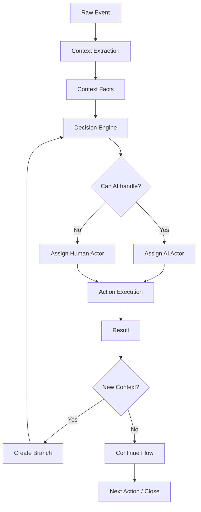

# AI-Driven Context Workflow System for Dental Implant Clinic

**White Paper v0.1**  
**Prepared:** April 28, 2026  
**Status:** Concept architecture / living document  
**Audience:** product, engineering, data, AI/automation, operations, coordinators, clinic leadership  

---

## 0. Purpose of this document

This white paper captures the conceptual architecture that emerged from the discussion about building a new internal database, workflow system, and AI-agent execution layer for a dental implant clinic.

The goal is to make sure the project does not lose the ideas that were developed during the early design conversation:

- the system is not just another CRM;
- every active contact must always have a next action or active flow;
- actions are executed by either humans or AI agents;
- calls, SMS messages, appointments, consultations, and clinical events are raw events;
- events generate context;
- context can create branches in a workflow tree;
- context has urgency, SLA, and routing rules;
- context can be reinterpreted later as new events happen;
- segments are useful, but they are derived from events and context, not the source of truth;
- consultations are not just events, but larger episodes containing many actors, facts, outcomes, and future automation opportunities;
- the database must be designed so the system can gradually replace human work with AI-agent execution while keeping auditability, safety, and human fallback.

This document should be treated as **v0.1**. Some design decisions are intentionally left open because they will become clearer during implementation.

---

## 1. Executive summary

The platform should become an **AI-native operating system for clinic operations**, not a traditional CRM.

The core operating model is:

```text
Raw Event → Context → Decision → Branch / Flow → Action → Result → New Event
```

The platform should collect raw facts from Salesforce, CareStack, Twilio/Vapi/RingCentral, SMS, email, forms, and internal tools. It should preserve those raw facts as immutable evidence, then use AI and deterministic rules to extract structured context.

That context drives routing, urgency, SLA, workflow branching, AI-agent execution, human escalation, segmentation, reactivation, and analytics.

The system is designed for a hybrid starting point:

- many actions are still handled by coordinators and call-center staff;
- AI agents handle simple or well-understood contexts;
- when AI cannot confidently resolve context, the system routes the branch to a human;
- after a human resolves recurring contexts, that behavior can become a new AI capability or automated flow.

Over time, the system should move from:

```text
70% human / 30% AI
```

toward:

```text
30% human / 70% AI
```

and eventually toward:

```text
AI handles normal cases; humans handle exceptions, risk, judgment, and edge cases.
```

---

## 2. Relation to the existing MVP architecture

This white paper extends the existing MVP architecture for the unified dental clinic database.

The existing architectural foundation already defines:

- one local FastAPI application;
- one local PostgreSQL instance / cluster for MVP;
- logical schemas: `ingest`, `identity`, `phi`, `ops`, `audit`;
- Salesforce as the starting marketing / CRM source system;
- CareStack as the starting medical / practice-management source system;
- Twilio, Vapi, email, forms, and communication systems as event inputs;
- one unified `person_uid` as the global person identifier;
- separation between PHI and ops-safe projections;
- AI agents accessing data through tool endpoints, not raw SQL.

This white paper adds the next conceptual layer:

- actors as first-class entities;
- workflow trees;
- action steps;
- context events;
- urgency and SLA;
- encounters / consultation episodes;
- context graphs;
- derived segments;
- insights;
- reprocessing;
- human-to-AI automation migration.

---

## 3. Core thesis

The system should be designed around five core entities:

```text
Person
Actor
Event
Context
Action
```

And three higher-level structures:

```text
Flow
Encounter
Insight
```

### 3.1 Person

The patient, lead, contact, or customer. This is the human being the clinic is working with.

A person may first appear as:

- a Salesforce Lead;
- a Salesforce Contact;
- a CareStack patient;
- an inbound caller;
- an SMS conversation;
- a form submission;
- a consultation attendee;
- an existing patient returning later.

The system must unify these identities under one global identifier:

```text
person_uid
```

### 3.2 Actor

The executor of work.

An actor can be:

- a human coordinator;
- a call-center employee;
- a treatment coordinator;
- a doctor;
- a system job;
- an AI voice agent;
- an AI SMS agent;
- an AI finance agent;
- an AI appointment agent;
- an AI summarization or extraction agent.

The important design rule is:

```text
Humans and AI agents are both actors.
```

That means every task and action can be assigned using the same model, regardless of whether the executor is a person or an AI.

### 3.3 Event

Something that happened.

Examples:

- SMS received;
- SMS sent;
- call started;
- call completed;
- voice transcript created;
- appointment scheduled;
- appointment cancelled;
- appointment completed;
- consultation completed;
- treatment plan created;
- payment collected;
- patient no-showed;
- coordinator added a note;
- AI agent generated a recommendation;
- human reassigned a task.

Events are raw facts. They should be stored as evidence and should not be overwritten.

### 3.4 Context

The meaning extracted from an event.

Examples:

- `appointment_confusion`;
- `price_objection`;
- `financing_question`;
- `ready_to_schedule`;
- `fear_or_anxiety`;
- `timing_objection`;
- `clinical_question`;
- `needs_human_review`;
- `urgent_sms_reply_needed`;
- `high_value_case`;
- `patient_arrived`;
- `patient_lost_interest`.

One event can produce multiple contexts.

For example, a single SMS:

> “I am outside, where is my appointment?”

can generate:

```json
{
  "intent": "appointment_confusion",
  "urgency": "critical",
  "channel": "sms",
  "requires_response": true,
  "routing": "appointment_agent_or_human",
  "sla_minutes": 5
}
```

### 3.5 Action

A task or execution step.

Examples:

- call patient;
- send SMS;
- generate message draft;
- assign coordinator;
- schedule appointment;
- reschedule consultation;
- send financing link;
- create CareStack note;
- update Salesforce status;
- ask doctor for review;
- start reactivation flow;
- escalate to supervisor.

An action always has an executor:

```text
Action Step → assigned_actor_id
```

---

## 4. Guiding principles

### 4.1 Do not build another CRM

The system should not simply duplicate Salesforce or CareStack. It should become the canonical operational intelligence layer that connects identity, events, context, actions, workflows, AI agents, and human teams.

### 4.2 Raw data is the source of truth

Raw events, messages, call metadata, transcripts, CareStack payloads, and Salesforce payloads must be preserved.

Derived interpretations can change. Raw evidence should not.

### 4.3 Context is a hypothesis, not permanent truth

A context extracted today may be reinterpreted tomorrow.

Example:

Day 1:

```text
Patient: “It is too expensive.”
Context: price_objection
```

Day 3:

```text
Patient: “I am ready to schedule if financing works.”
Updated interpretation: not lost, but financing-sensitive / hesitant
```

Therefore context should be versioned or superseded, not silently overwritten.

### 4.4 Segments are derived, not source-of-truth

Segments are useful for UI, analytics, and bulk actions, but they should not be the foundation of runtime decision logic.

Correct model:

```text
Events + Context Graph → Decision → Action
```

Segments are derived views:

```text
Events + Context Graph → Segment membership
```

### 4.5 Every active contact needs a next action

For any person who is not closed, completed, inactive, or intentionally trashed, the system should enforce:

```text
Active contact must have:
- an active flow; or
- an open next action; or
- a valid paused state with reason.
```

No active lead/patient should sit in the database with no owner, no task, and no next action.

### 4.6 Flow is a tree, not a fixed linear sequence

Workflows should support branching.

A simple workflow may start linear:

```text
AI SMS → AI call → human call → close
```

But if a new context appears, it becomes a branch:

```text
AI call
  └── Context: price objection
        ├── AI finance branch
        └── Human coordinator fallback
```

### 4.7 Humans and AI are interchangeable actors at the data-model level

The system should not model AI actions separately from human actions. The difference should be in actor type and capabilities.

```text
actor_type = human | ai | system
```

### 4.8 AI should never have raw database access

AI agents should call tools and service endpoints. Every meaningful action or data access should be auditable.

### 4.9 PHI and ops-safe data must be separated

Clinical / PHI content can be available to authorized roles and HIPAA-appropriate agents. Marketing and ops-safe agents should only see safe projections.

### 4.10 Unknowns are expected

Some parts of the model should remain flexible because workflow patterns, context taxonomies, and agent capabilities will evolve during implementation.

---

## 5. Conceptual system pipeline



The pipeline should support both real-time and batch execution.

### 5.1 Real-time pipeline

Used for urgent contexts:

- inbound SMS;
- appointment confusion;
- missed calls;
- patient arrived;
- same-day scheduling;
- high-value leads;
- no-show recovery;
- urgent reschedule requests.

### 5.2 Batch pipeline

Used for reprocessing and analytics:

- nightly context graph reanalysis;
- segment refresh;
- stale lead detection;
- old opportunity reactivation;
- attribution analysis;
- consultation outcome mining;
- AI recommendation generation.

---

## 6. Event model

An event is a raw fact.

Events should include both metadata and content.

### 6.1 Event metadata

Examples:

```json
{
  "event_type": "call_completed",
  "channel": "voice",
  "direction": "outbound",
  "source_system": "vapi",
  "from_actor_id": "ai_sofia",
  "to_person_uid": "person_123",
  "started_at": "2026-04-28T10:15:00Z",
  "ended_at": "2026-04-28T10:19:00Z",
  "duration_seconds": 240,
  "recording_url": "...",
  "transcript_id": "..."
}
```

```json
{
  "event_type": "sms_received",
  "channel": "sms",
  "direction": "inbound",
  "from_person_uid": "person_123",
  "to_actor_or_number": "+1415...",
  "occurred_at": "2026-04-28T12:01:00Z",
  "message_text": "Where is my appointment?"
}
```

### 6.2 Event content

The content may include:

- SMS body;
- email body;
- chat message;
- transcript;
- call summary;
- recording URL;
- appointment notes;
- consultation transcript;
- CareStack payload;
- Salesforce payload;
- human note.

### 6.3 One event can create many contexts

A single consultation transcript may create:

- clinical recommendation;
- patient objection;
- financing concern;
- doctor instruction;
- coordinator follow-up requirement;
- service-line classification;
- sales outcome;
- reactivation opportunity;
- PHI-only facts;
- ops-safe summary.

---

## 7. Context model

Context is the semantic layer extracted from events.

### 7.1 Context types

Initial recommended taxonomy:

| Context type | Purpose | Examples |
|---|---|---|
| `intent` | What the person wants | schedule, reschedule, price question |
| `objection` | Why they may not proceed | price, fear, timing, trust, second opinion |
| `urgency` | How fast response is needed | critical, high, medium, low |
| `emotion` | Sentiment / attitude | anxious, hesitant, angry, interested |
| `stage_signal` | Lifecycle movement | ready_to_book, consult_done, lost_interest |
| `outcome` | Result of encounter/action | won, lost, pending, no_show |
| `risk` | Risk flag | likely_to_drop, missed_surgery, payment_overdue |
| `opportunity` | Positive chance | high_value, reactivation_candidate |
| `clinical_phi` | PHI-specific fact | procedure, treatment detail, clinical note |
| `ops_safe` | Non-clinical projection | service line, priority, next action |
| `unknown` | Not classified | needs review |

### 7.2 Context fields

Conceptual fields:

```text
context_id
person_uid
event_id
encounter_id nullable
flow_id nullable
node_id nullable
context_type
context_key
context_value_jsonb
confidence_score
urgency_level
sla_due_at
requires_human
suggested_actor_type
suggested_actor_id nullable
source_kind
source_ref
model_name
prompt_version
version
status
created_at
superseded_by_context_id nullable
```

### 7.3 Context versioning

Do not silently overwrite context.

Use:

- `version`;
- `status` = proposed / active / superseded / rejected / confirmed;
- `superseded_by_context_id`;
- `reviewed_by_actor_id`;
- `reviewed_at`.

This allows the system to say:

```text
At first we believed this was a price rejection.
After later messages, we reinterpreted it as financing hesitation.
```

---

## 8. Urgency and SLA

Every important context should have urgency.

### 8.1 Recommended urgency levels

| Level | Typical SLA | Examples |
|---|---:|---|
| `critical` | 0–5 min | patient is at office, appointment confusion, urgent reschedule, missed call from hot lead |
| `high` | 5–30 min | pricing question, financing question, wants appointment today, no-show recovery |
| `medium` | 1–6 hours | passive interest, thinking, needs follow-up |
| `low` | 24+ hours | old lead, nurture, reactivation batch |

### 8.2 Routing logic

```pseudo
if urgency == critical:
    try AI immediately if safe and capable
    if not resolved quickly:
        assign human immediately

elif urgency == high:
    try AI first
    fallback to human before SLA expiration

elif urgency == medium:
    queue for AI or human follow-up

elif urgency == low:
    batch into automation or nurture flow
```

### 8.3 Escalation

If SLA expires:

```pseudo
if action.sla_due_at < now and status != done:
    escalate to available actor
    notify supervisor if needed
    log escalation event
```

---

## 9. Actor model

The introduction of execution creates the need for a formal actor model.

### 9.1 Actor definition

```text
Actor = any entity that can perform or own work.
```

Actor types:

- `human`;
- `ai`;
- `system`;
- `external_service`.

### 9.2 Actor examples

Human actors:

- coordinator;
- treatment coordinator;
- call-center agent;
- doctor;
- manager;
- admin.

AI actors:

- Sofia voice agent;
- Appointment assistant;
- Financing assistant;
- Objection handler;
- Consultation summarizer;
- PHI extraction agent;
- Marketing safe-summary agent;
- Reprocessing agent.

System actors:

- sync job;
- scheduler;
- escalation engine;
- segmentation job.

### 9.3 Actor fields

Conceptual table:

```text
actor_id
actor_type
actor_name
role
status
source_system nullable
source_actor_id nullable
email nullable
phone nullable
capabilities_jsonb
permissions_jsonb
availability_status
created_at
updated_at
```

### 9.4 Actor capabilities

Capabilities define what an actor can do.

Examples:

```json
{
  "ai_sofia": ["voice_call", "lead_qualification", "booking_prompt"],
  "ai_finance": ["explain_financing", "send_financing_link"],
  "human_coordinator": ["call", "sms", "reschedule", "close_sale", "handle_objection"],
  "doctor": ["clinical_review", "treatment_plan_explanation"]
}
```

Routing should match:

```text
context requirement → actor capability
```

### 9.5 Salesforce / CareStack users

Existing users in Salesforce and CareStack should be synced or mapped into actors.

Salesforce fields such as `OwnerId`, `User__c`, and task owners become actor mappings.

CareStack provider IDs and coordinator IDs can also become actors or linked actor identifiers.

---

## 10. Action model

An action is a specific execution step.

### 10.1 Action fields

```text
action_id
person_uid
flow_id nullable
node_id nullable
encounter_id nullable
context_id nullable
action_type
assigned_actor_id
assigned_actor_type
created_by_actor_id
status
priority
urgency_level
sla_due_at
due_at
started_at
completed_at
result_status
result_summary
result_payload_jsonb
source_system nullable
external_task_id nullable
created_at
updated_at
```

### 10.2 Statuses

Recommended statuses:

```text
pending
assigned
in_progress
waiting_on_person
waiting_on_actor
blocked
completed
failed
cancelled
superseded
escalated
```

### 10.3 Mandatory next action rule

For every active contact:

```pseudo
if person.lifecycle_status not in (closed, trashed, completed, inactive):
    assert exists(open action) or exists(active flow) or exists(valid pause reason)
```

This can be enforced by a dashboard, job, or application-level rule before MVP database constraints are ready.

---

## 11. Flow model

A flow is a process that moves a person toward a goal.

### 11.1 Flow examples

- lead follow-up;
- speed-to-lead;
- consultation booking;
- no-show recovery;
- price objection recovery;
- financing recovery;
- treatment-plan conversion;
- surgery scheduling;
- post-consult follow-up;
- recall;
- reactivation;
- payment collection;
- appointment confirmation;
- missed-call recovery.

### 11.2 Flow as a tree

Flows should support nodes and branches.

```text
Flow Instance
  ├── Node: AI SMS
  ├── Node: AI Call
  │     ├── Branch: no answer
  │     ├── Branch: price objection
  │     └── Branch: ready to schedule
  └── Node: Close / Complete
```

### 11.3 Flow definition vs flow instance

The system should separate reusable flow templates from actual patient-specific executions.

#### Flow definition

A reusable blueprint:

```text
flow_definition_id
name
flow_type
version
trigger_rules_jsonb
default_sla_policy_jsonb
status
created_at
```

#### Flow instance

A concrete execution for one person:

```text
flow_instance_id
flow_definition_id
person_uid
status
started_at
completed_at
current_node_id
created_by_actor_id
```

### 11.4 Node model

```text
node_id
flow_instance_id
parent_node_id nullable
node_type
context_id nullable
action_id nullable
status
branch_reason
created_at
```

Node types:

```text
start
action
decision
context
branch
wait
end
```

### 11.5 Branch creation rule

A branch should be created when a new context changes the expected path.

```pseudo
if context.key not in expected_contexts_for_current_node:
    create branch node
    route branch to AI or human
```

---

## 12. Encounter model

A major insight from the discussion is that some business objects are bigger than individual events.

A consultation is not just one event. It is an episode.

### 12.1 Encounter definition

```text
Encounter = a bounded episode of work involving a person, one or more actors, multiple events, extracted context, and an outcome.
```

Examples:

- consultation;
- surgery visit;
- financing discussion;
- major phone call;
- treatment-plan presentation;
- no-show recovery episode;
- reactivation attempt;
- payment collection conversation.

### 12.2 Consultation encounter

A consultation may contain:

- doctor speech;
- coordinator speech;
- patient questions;
- treatment recommendation;
- proposed price;
- financing discussion;
- patient objections;
- closing attempt;
- next step;
- outcome;
- reason if lost;
- safe summary;
- PHI summary;
- follow-up task;
- reactivation opportunity.

### 12.3 Encounter fields

```text
encounter_id
person_uid
encounter_type
status
started_at
ended_at
location_id nullable
source_system nullable
source_record_id nullable
primary_actor_id nullable
outcome
outcome_reason
summary_phi nullable
summary_ops_safe nullable
created_at
updated_at
```

### 12.4 Encounter participants

```text
encounter_participant_id
encounter_id
actor_id nullable
person_uid nullable
participant_role
source_system nullable
source_participant_id nullable
```

Participant roles:

```text
patient
doctor
coordinator
ai_agent
call_center
observer
system
```

### 12.5 Encounter artifacts

```text
artifact_id
encounter_id
artifact_type
source_system
source_ref
storage_uri nullable
text_content nullable
contains_phi
created_at
```

Artifacts can include:

- audio recording;
- transcript;
- uploaded document;
- CareStack note;
- Salesforce task;
- SMS thread;
- consultation summary.

### 12.6 Encounter outcome

Outcome should be structured.

```json
{
  "result": "lost",
  "reason_category": "price",
  "reason_subtype": "too_expensive",
  "confidence": 0.86,
  "recommended_next_flow": "price_recovery_flow"
}
```

Outcomes are crucial because they create future work:

```text
Encounter outcome → segment / insight → flow trigger → action
```

---

## 13. Context graph

The system should not think about a person as a flat profile only. It should maintain a graph of events, contexts, actions, and outcomes.

### 13.1 Graph structure

```text
Event → Context
Context → Action
Action → Event
Event → Encounter
Encounter → Outcome
Outcome → Flow
Flow → Action
```

### 13.2 Why graph matters

Context can change based on later events.

Example:

```text
Event 1: Patient says price is too high.
Context 1: price_objection.

Event 2: Patient asks about financing.
Context 2: financing_interest.

Event 3: Patient asks for appointment times.
Context 3: ready_to_schedule.

Graph insight: not lost, high-value financing-sensitive lead.
```

### 13.3 Context graph edge fields

```text
edge_id
from_entity_type
from_entity_id
to_entity_type
to_entity_id
edge_type
confidence_score
created_by_actor_id
created_at
```

Edge types:

```text
caused
supersedes
supports
contradicts
triggers
belongs_to
resolved_by
created_from
```

---

## 14. Segments

Segments are useful, but they should be derived.

### 14.1 Segment principle

```text
Segments are not truth.
Segments are cached interpretations of events + context + graph.
```

### 14.2 Segment examples

- price objection last 30 days;
- no-show not rescheduled;
- financing denied but high treatment value;
- consultation completed but no surgery scheduled;
- missed call from hot lead;
- appointment confusion unresolved;
- treatment plan accepted but no payment;
- surgery scheduled tomorrow unconfirmed;
- old implant leads with no follow-up;
- high-value patients with no next action.

### 14.3 Segment definition

```text
segment_definition_id
name
description
query_logic_jsonb
source_context_keys
refresh_policy
created_by_actor_id
status
created_at
```

### 14.4 Segment membership

```text
segment_membership_id
segment_definition_id
person_uid
matched_at
match_reason_jsonb
confidence_score
expires_at nullable
```

### 14.5 Segment usage

Segments are useful for:

- UI lists;
- coordinator work queues;
- reporting;
- batch AI jobs;
- campaign targeting;
- flow triggers.

But runtime decisions should still consult the underlying context graph when possible.

---

## 15. Insight model

An insight is a higher-level pattern detected from multiple contexts and events.

### 15.1 Insight examples

- `price_sensitive_high_value`;
- `likely_to_convert_if_financing_offered`;
- `consult_done_no_close`;
- `lost_due_to_timing_reactivation_candidate`;
- `urgent_appointment_confusion`;
- `doctor_recommended_treatment_not_presented`;
- `coordinator_followup_missing`;
- `patient_ready_to_schedule`.

### 15.2 Insight fields

```text
insight_id
person_uid
encounter_id nullable
flow_id nullable
insight_type
insight_value_jsonb
confidence_score
evidence_jsonb
recommended_action_type
recommended_flow_definition_id nullable
status
created_by_actor_id
created_at
superseded_by_insight_id nullable
```

### 15.3 Insight lifecycle

```text
proposed → active → acted_on → resolved / superseded / rejected
```

---

## 16. Reprocessing and reinterpretation

The system must be able to revisit old data.

### 16.1 Why reprocessing is required

Because:

- context can change;
- prompts improve;
- new AI models improve;
- new segment definitions appear;
- new flow logic appears;
- new business strategies appear;
- new clinical or operational categories become useful.

### 16.2 Reprocessing examples

- reanalyze all consultations from last 90 days for price objections;
- identify all patients who were lost due to timing but may be ready now;
- find conversations where patient asked about financing but no financing link was sent;
- reclassify old “lost” opportunities into new recovery segments;
- detect missed urgent SMS contexts from prior days.

### 16.3 Reprocessing job fields

```text
reprocessing_job_id
job_type
scope_jsonb
model_name
prompt_version
status
started_at
completed_at
created_by_actor_id
summary_jsonb
```

---

## 17. UI / UX concept

The UI should reflect the actual operating model.

It should not just display tables. It should show:

- who needs action;
- why;
- how urgent it is;
- who owns it;
- whether AI can handle it;
- what context created the task;
- what branch of the flow the patient is in;
- what the next action is;
- whether the case can be automated in the future.

### 17.1 Main dashboard / command center

Purpose:

- see global operational state;
- view urgent queues;
- view active segments;
- ask AI questions;
- start bulk actions.

Key blocks:

```text
AI Query Bar
Live Response Queue
Critical Contexts
Overdue SLA Queue
Active Flow Counts
No Next Action Alerts
Segment Lists
Coordinator Workload
AI Automation Coverage
```

### 17.2 Patient / person card

Purpose:

- one place to understand the person;
- see active flow;
- see next action;
- see timeline;
- see AI summary;
- see context history;
- perform or assign actions.

Suggested layout:

```text
Header:
- name
- phone
- lifecycle status
- source
- assigned actor
- risk / priority

AI Summary:
- current state
- recent context
- recommended next action

Active Flow:
- flow name
- current node
- branches
- unresolved context

Next Action:
- action type
- assigned actor
- SLA
- buttons: complete / reassign / AI do it / escalate

Timeline:
- raw events
- actions
- context facts
- outcomes

Encounter History:
- consultation
- surgery
- calls
- financing episodes

Context History:
- current context
- previous context versions
- superseded interpretations
```

### 17.3 Live response queue

Purpose:

- handle urgent contexts.

Example rows:

```text
Patient | Channel | Context | Urgency | SLA | Assigned | Action
John    | SMS     | appointment_confusion | critical | 3 min | AI appointment agent | monitor
Maria   | SMS     | price_question        | high     | 18 min | coordinator          | reply
Alex    | Call    | missed_hot_lead       | high     | 10 min | Sofia AI             | call now
```

### 17.4 Flow tree view

Purpose:

- visualize workflow progress and branches.

Example:

```text
Flow: No-show recovery

├─ SMS reminder (AI) ✅
├─ AI call ✅
│   └─ Context: price objection
│       ├─ Financing branch (AI) 🔄
│       └─ Human coordinator fallback ⏳
└─ Follow-up decision pending
```

### 17.5 Context review panel

Purpose:

- let humans correct AI interpretations;
- approve / reject facts;
- assign new agent;
- convert a recurring human task into automation.

Example controls:

```text
[Approve context]
[Reject context]
[Change urgency]
[Assign to AI agent]
[Assign to coordinator]
[Create new flow branch]
[Save as future automation]
```

### 17.6 Segment builder

Purpose:

- create operational lists from derived context.

Example natural-language query:

```text
Show all patients who had consultation in last 30 days, had price objection, and no follow-up task.
```

Result:

```text
Segment: price_objection_no_followup_30d
Recommended flow: price_recovery_flow
```

---

## 18. AI-agent architecture

### 18.1 Agent categories

Potential agents:

| Agent | Scope | Typical work |
|---|---|---|
| Appointment Agent | ops-safe | scheduling, rescheduling, appointment questions |
| Sofia Voice Agent | ops-safe | lead call, qualification, simple follow-up |
| SMS Response Agent | ops-safe | reply to inbound texts |
| Financing Agent | ops-safe / sensitive financial | financing explanation, links, follow-up |
| Objection Handler | ops-safe | price, fear, timing, trust objections |
| Consultation Summarizer | PHI / ops-safe split | summarize transcript into PHI and safe views |
| PHI Extraction Agent | PHI | clinical facts, treatment case support |
| Coordinator Assistant | mixed with permissions | prepare human tasks and scripts |
| Reprocessing Agent | internal | reanalyze history and generate insights |
| Segment Agent | internal | discover new operational segments |

### 18.2 Agent tool rules

Agents should not query raw SQL.

Agents should use tools such as:

```text
resolve_person
get_ops_snapshot
get_phi_snapshot
get_recent_events
get_context_graph
create_action
complete_action
create_flow_branch
assign_actor
create_followup_task
write_context_fact
review_context_fact
create_segment
trigger_flow
```

Every tool call should be logged.

### 18.3 Agent confidence and fallback

AI agents should not be allowed to act without guardrails.

Decision rule:

```pseudo
if confidence >= threshold and action_risk <= allowed_risk:
    AI may act
else:
    human review required
```

Thresholds may differ by context type.

---

## 19. Suggested database domains

The existing MVP domains are still valid:

```text
ingest
identity
phi
ops
audit
```

This white paper suggests additional logical domains or submodules:

```text
actor
interaction
context
workflow
encounter
insight
segmentation
```

These do not necessarily need to be separate PostgreSQL schemas on day one. They can be modeled as tables inside existing schemas, but conceptually they should be separated.

### 19.1 Suggested table map

| Domain | Tables |
|---|---|
| `identity` | `person`, `person_identifier`, `source_link`, `merge_event` |
| `actor` | `actor`, `actor_capability`, `actor_source_link`, `actor_availability` |
| `ingest` | `raw_event`, `sync_job` |
| `interaction` | `event`, `event_content`, `transcript_artifact`, `message_artifact` |
| `context` | `context_fact`, `context_version`, `context_graph_edge` |
| `workflow` | `flow_definition`, `flow_instance`, `flow_node`, `action_step`, `action_result`, `escalation_event` |
| `encounter` | `encounter`, `encounter_participant`, `encounter_artifact`, `encounter_outcome` |
| `ops` | `lead`, `pipeline_stage`, `safe_summary`, `followup_task`, `revenue_event` |
| `phi` | `patient_profile`, `appointment`, `consultation`, `treatment_case`, `transcript_raw`, `extracted_fact` |
| `segmentation` | `segment_definition`, `segment_membership`, `segment_refresh_job` |
| `insight` | `insight`, `recommendation`, `reprocessing_job` |
| `audit` | `access_log`, `agent_tool_call`, `action_audit_log`, `data_access_log` |

---

## 20. MVP implementation strategy

The full system is large. MVP should be staged.

### Phase 1: Foundation

Build or confirm:

- `identity.person`;
- `identity.person_identifier`;
- `identity.source_link`;
- `ingest.raw_event`;
- basic Salesforce and CareStack sync;
- basic actor table;
- basic person card;
- basic task / action table;
- audit log.

### Phase 2: Interaction timeline

Build:

- unified event timeline;
- call and SMS ingestion;
- transcript storage / linking;
- event metadata normalization;
- person-level interaction view.

### Phase 3: Context extraction

Build:

- context extraction pipeline;
- context_fact table;
- urgency classification;
- confidence scores;
- human review UI;
- basic context history.

### Phase 4: Workflow / next action engine

Build:

- flow instance;
- action steps;
- mandatory next-action dashboard;
- routing AI vs human;
- SLA queue;
- escalation.

### Phase 5: Encounter model

Build:

- consultation encounter;
- encounter participants;
- encounter artifacts;
- PHI summary;
- ops-safe summary;
- outcome and reason extraction.

### Phase 6: Segments and insights

Build:

- derived segment definitions;
- segment membership refresh;
- insight generation;
- reactivation flow triggers;
- batch reprocessing.

### Phase 7: Automation migration

Build:

- “convert human resolution to automation” UI;
- agent capability mapping;
- flow branch automation;
- playbooks;
- agent performance reporting.

---

## 21. Example workflows

### 21.1 No-show recovery

```text
Trigger: appointment status = no_show

Flow:
1. AI sends SMS: check-in / reschedule prompt
2. If reply received:
   - classify urgency and intent
   - appointment question → appointment agent
   - price objection → finance/objection branch
   - angry/confused → human coordinator
3. If no reply:
   - AI call
4. If AI call unresolved:
   - human follow-up task
5. If rescheduled:
   - close flow
6. If declined:
   - extract reason and start reactivation flow later
```

### 21.2 Consultation outcome mining

```text
Trigger: consultation transcript uploaded

Flow:
1. Store raw transcript
2. Extract PHI facts into PHI scope
3. Extract ops-safe summary
4. Extract outcome and reason
5. If won:
   - update treatment conversion flow
6. If lost due to price:
   - start price recovery flow
7. If lost due to timing:
   - start delayed reactivation flow
8. If unclear:
   - assign coordinator review
```

### 21.3 Urgent SMS appointment context

```text
Trigger: inbound SMS
Message: “Where is my appointment?”

Context:
- intent = appointment_confusion
- urgency = critical
- SLA = 5 minutes

Decision:
- appointment agent may respond if appointment data is available
- if appointment data is missing or confidence low → human immediately

Action:
- reply with appointment location/time or assign coordinator
```

### 21.4 Price objection

```text
Trigger: call or consultation transcript contains price objection

Context:
- objection = price
- urgency = high or medium depending on recency and stage
- possible flow = financing recovery

Actions:
- AI finance explanation
- send financing link
- schedule human callback if needed
- add to price-sensitive segment
- create insight if high-value case
```

---

## 22. Open questions

These questions should remain visible during implementation.

### 22.1 Context granularity

How small should contexts be?

Options:

- broad context: `price_objection`;
- detailed context: `price_objection + financing_possible + not_lost + high_value`.

Recommendation: start with broad taxonomy and add detail only where it changes actions.

### 22.2 Context versioning policy

Should every reinterpretation create a new row, or should some low-risk context be updated in place?

Recommendation: create new versions for AI-derived context that affects actions, routing, risk, or analytics.

### 22.3 PHI boundary

Which transcripts and facts can be used by ops agents?

Recommendation: raw transcripts with PHI stay in PHI scope. Ops gets safe projections.

### 22.4 AI confidence thresholds

Different actions need different confidence thresholds.

Examples:

- sending a simple appointment reminder may require lower confidence;
- clinical interpretation requires high confidence and review;
- pricing/financing messaging may need human-approved templates.

### 22.5 Human fallback policy

When should the system immediately route to a human?

Possible triggers:

- low AI confidence;
- angry patient;
- legal / compliance question;
- clinical question;
- appointment emergency;
- payment dispute;
- VIP / high-value patient;
- repeated failed AI attempts.

### 22.6 Actor availability

Should routing consider real-time human availability?

Recommendation: yes, but not required for the first MVP.

### 22.7 Segment storage

Should segment membership be stored or computed on demand?

Recommendation:

- compute from context graph;
- cache/materialize for UI and batch jobs;
- never treat segment membership as immutable truth.

### 22.8 Encounter boundaries

When does an encounter start and end?

Examples:

- one consultation appointment;
- one long phone call;
- one multi-message SMS thread over several hours;
- a recovery episode across multiple days.

Recommendation: start with explicit clinical/appointment encounters, then expand to communication episodes.

### 22.9 CareStack writes

Which write operations are supported and safe?

Need to confirm:

- create patient;
- create appointment;
- update appointment;
- add note;
- update demographics;
- attach documents.

### 22.10 Storage and retention

How long should raw audio and transcripts be retained?

Need legal/compliance review.

---

## 23. What not to do

Do not:

- give AI direct SQL access;
- build one giant mixed table;
- make segments the source of truth;
- overwrite raw context without versioning;
- let active contacts exist without next action;
- mix PHI into marketing views;
- create tasks without assigned actors;
- create AI agents that cannot be audited;
- rely only on Salesforce task fields for internal action orchestration;
- ignore human fallback;
- treat consultation as just a simple appointment event.

---

## 24. Recommended immediate next deliverables

After this white paper, the next project documents should be:

1. **Conceptual ERD**  
   Person, Actor, Event, Context, Flow, Action, Encounter, Segment, Insight.

2. **MVP database schema draft**  
   Tables, fields, constraints, indexes, versioning.

3. **Event taxonomy**  
   Standard event types from Salesforce, CareStack, Twilio/Vapi, SMS, email, manual actions.

4. **Context taxonomy v0.1**  
   Intents, objections, urgency levels, outcomes, risk signals.

5. **AI extraction prompt spec**  
   Prompt outputs, JSON schemas, confidence scoring, PHI vs ops-safe extraction.

6. **Decision engine spec**  
   Routing rules, SLA rules, human fallback, flow branching.

7. **UI wireframes**  
   Dashboard, patient card, live queue, flow tree, context review panel.

8. **Agent tool contract spec**  
   Tools AI agents may call, inputs/outputs, audit rules.

9. **RBAC and PHI/ops boundary matrix**  
   Who can see what, which agents can access which data.

10. **Reprocessing strategy**  
    How to reanalyze old events and update context/segments safely.

---

## 25. Final conceptual summary

The system should be understood as:

```text
A temporal, context-driven, actor-executed workflow engine for dental implant clinic operations.
```

It is temporal because meaning changes over time.

It is context-driven because decisions come from extracted meaning, not static fields.

It is actor-executed because every action belongs to either a human, AI agent, or system actor.

It is workflow-based because every active contact must be moving through a process.

It is graph-based because events, contexts, actions, outcomes, and flows are connected.

It is AI-native because AI does not merely summarize data; it participates in execution, routing, reprocessing, and automation discovery.

The long-term goal is not simply to store patient data.

The long-term goal is to build a system where:

```text
Every patient has a current state.
Every active patient has a next action.
Every action has an actor.
Every event can generate context.
Every context can create a branch.
Every branch can be handled by AI or escalated to a human.
Every human resolution can become future automation.
```

That is the foundation for gradually turning clinic operations into an AI-assisted, auditable, adaptive operating system.

---

## Appendix A. Glossary

| Term | Meaning |
|---|---|
| Person | The unified patient/contact/lead identity |
| Actor | A human, AI agent, system job, or external service that performs work |
| Event | A raw fact that happened |
| Context | AI/rule-derived meaning from an event |
| Action | A task or executable step |
| Flow | A workflow process, usually with branches |
| Node | A point inside a flow tree |
| Branch | A new path created by context |
| Encounter | A bounded episode such as consultation, call, surgery, or financing discussion |
| Outcome | Result of an encounter or flow |
| Segment | Derived grouping of people matching context/history rules |
| Insight | Higher-level pattern inferred from event/context graph |
| SLA | Time requirement for response/action |
| PHI | Protected health information |
| Ops-safe | Non-clinical projection safe for operations/marketing workflows |

---

## Appendix B. Minimal MVP entity set

For the first implementation pass, the minimum set is:

```text
person
actor
raw_event
event
context_fact
action_step
flow_instance
flow_node
encounter
encounter_participant
encounter_artifact
safe_summary
access_log
agent_tool_call
```

This is enough to support:

- unified person identity;
- human/AI actors;
- events;
- context extraction;
- urgent queues;
- next actions;
- flow branching;
- consultation episodes;
- auditability.

---

## Appendix C. Suggested first UI screens

1. **Dashboard / AI Command Center**
2. **Live SLA Queue**
3. **Person Card**
4. **Flow Tree View**
5. **Context Review Panel**
6. **Encounter Detail Page**
7. **Segment Builder**
8. **Actor Workload / Automation Coverage View**

---

## Appendix D. Suggested first AI extraction JSON schema

```json
{
  "event_id": "string",
  "person_uid": "string",
  "contexts": [
    {
      "context_type": "intent | objection | urgency | emotion | outcome | risk | opportunity | clinical_phi | ops_safe | unknown",
      "context_key": "string",
      "context_value": {},
      "confidence_score": 0.0,
      "urgency_level": "critical | high | medium | low | none",
      "requires_human": true,
      "suggested_action": "string",
      "suggested_actor_type": "ai | human | system",
      "evidence": [
        {
          "source": "transcript | sms | call_metadata | appointment | human_note",
          "quote_or_ref": "string"
        }
      ]
    }
  ]
}
```

---

## Appendix E. Suggested first decision engine pseudocode

```pseudo
on_new_event(event):
    store_raw_event(event)

    contexts = extract_contexts(event)
    save_context_versions(contexts)

    for context in contexts:
        if context.urgency in (critical, high):
            create_or_update_live_queue_item(context)

        decision = route_context(context)

        if decision.requires_branch:
            branch = create_flow_branch(context)
        else:
            branch = get_current_flow_node(event.person_uid)

        action = create_action_step(
            person_uid = event.person_uid,
            context_id = context.id,
            assigned_actor = decision.actor,
            due_at = decision.sla_due_at,
            action_type = decision.action_type
        )

        if decision.actor.actor_type == "ai" and decision.auto_execute:
            execute_ai_action(action)
        else:
            notify_human_or_queue(action)

    refresh_person_current_state(event.person_uid)
```

---

## Appendix F. Document status

This document is intentionally not final.

It should evolve as the team learns:

- which contexts occur most often;
- which tasks humans handle repeatedly;
- which agents are reliable;
- where PHI boundaries must be stricter;
- which CareStack write operations are actually available;
- how coordinators prefer to work in the UI;
- which segments drive revenue recovery;
- which automations are safe to run without review.

The recommended next step is to turn this into a database schema draft and ERD.
